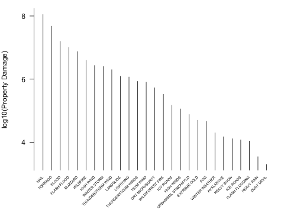

__Synopsis:__ This report analyzes National Oceanographic and Atmospheric Administration _Storm Data_ for population health effects and economic consequences across the United States.  The data were collected in between 1950 and November 2011.  

## Data Processing

### Population Health Effects

### Economic Consequences
The primary variable of economic interest is the amount of the property damages (in US dollars) that were caused by storm activity.  Property damage values are contained in a pair of variables (PROPDMG, PROPDMGEXP) in the original data set.  

1. The values in the two property damage columns were combined into a single _propertyDamage_ value column measures in dollars.  This new column was then added to the original data set.
2. It was determined that there are `r sprintf("%.0f", (902297 - 239174))` observations with zero ($0) dollars of property data.  Since property damage is the key economic variable of interest, storm events with $0 in property damage are not of interest.  This resulted in a 73% reduction in the size of the data set under consideration.

```{r}
source("../src/stormData.R")
```

## Analysis

### Population Health Effects

### Economic Consequences

1. The remaining storm data observations were grouped by state.  The top five storm events, in each state, in total property damage were identified.  
2. The state data was then sorted and grouped by the storm event type.  And, the results were plotted in a _profile plot_.  A profile plot is similar to a histogram or a bar chart, except the values are sorted from left to right from largest to smallest.   

## Results

### Population Health Effects

### Economic Consequences



